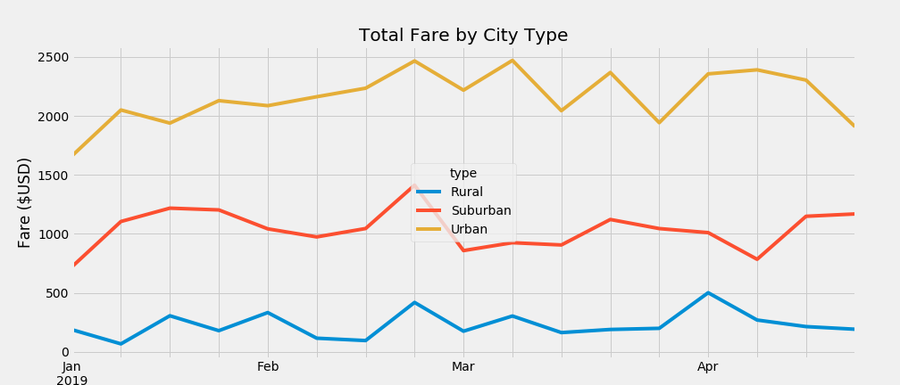

# PyBer Analysis

## Overview of the PyBer Analysis

For this project, you were tasked with analyzing data for a ride share company called PyBer. The project started with creating visualizations utilizing Matplotlib. The data supplied by the ride share company was imported, inspected and merged for further analyzation. This further analyzation started with creating DataFrames for each type of city (urban, suburban and rural) that was driven in. The number of rides, the average fare, and the average number of drivers for each city type was calculated as the key metrics. A bubble chart was created for all of the cities with this information. Furthermore, summary statistics of these metrics was calculated, a box and whisker plot was created, and finally, the percentages of total fares, total rides, and total drivers by city type were calculated and displayed in pie chart form.
After this had been submitted, further analysis was requested in the form of a summary DataFrame that had the total number or rides, total number of drivers and the total fares for each city type. The average fare per ride and average fare per driver for each city type was calculated to complete the summary DataFrame. For the final deliverable, a multiple-line chart of total fares for each city type within a specific time frame was created from the previously created DataFrame. All of this information was then gone over to give recommendations to the CEO of PyBer.

## Results of the New Analysis

### PyBer Summary DataFrame

The total number or rides, total number of drivers and the total fares for each city type was first calculated. Then, from this data further metrics were calculated in the form of average fare per ride and average fare per driver for each city type.
A DataFrame was created to observe and analyze the differences further:

Pyber Summary DataFrame

From this DataFrame the first thing that sticks out is that the Urban Total Rides and Total Drivers is the overall highest out of the city data types, and the respective Rural city type has the lowest Total Rides and Total Drivers.
This translates to Urban also having the highest Total fares, with Suburban being in the middle and Rural at the bottom.
Going through the data further, we see that the Average Fare per Ride and Average Fare per Driver columns shows a higher average for Rural city types versus the Urban city type which has the lowest averages. In the case of the Average Fare per Driver the difference is roughly 3 times between the $55.49 in the Rural city type and the $16.57 of the Urban city type.

### Total Weekly Fares of each City Type.

For the second deliverable, data from the beginning of January 2019 to the end of April 2019 was utilized to create a multiple-line chart. This would show by each city type the total fares within a given month:

Total Fare by City Type

 From this chart we can see that the Urban city type has the highest fare total across the board and stays mostly within the $2000's to mid-$2000's. The Suburban city type has fares that stay middle of the pack and average between the Urban and Rural around the upper $1000's. The Rural city type has the lowest overall fares across every month, but there is a high point of $500 at the beginning of April. Other things to note is that near the end of February all of the city data types peak at most of their highest fare values. Furthermore, while the Urban and Rural fares dip at the end of April, the Suburban city type fares rises instead.

## Summary

### Three Business Recommendations on City Disparities

- We will start with the "lowest performing" city type; the Rural city type. While overall the total rides, drivers and fares is the lowest, the averages of fares per ride and drivers is exponentially higher. Focusing on raising the total amount of rides will show an exponential rise in the total fare amount for this city type and increased profits.

- The Suburban city being the middle of fare performance wise has several interesting data points to analyze further. Near the end of February and April the total fares jump above the average for the Suburban city type. Further analysis should be conducted to find out what was occurring to produce these spikes, and perhaps focus on trying to make these rises occur more frequently and consistently.

- Finally, the Urban city type has the highest total amount of fares and rides. This being the best performing city type in these regards, the focus should mostly be on the drivers and ride amounts. While the averages will stay relatively low due to the nature of the city type, the number of rides and drivers is the changing factor to analyze. Specifically, what caused the spikes throughout March, and what caused the more consistent fares of April. Focusing on these metrics has the potential to increase profits overall.
